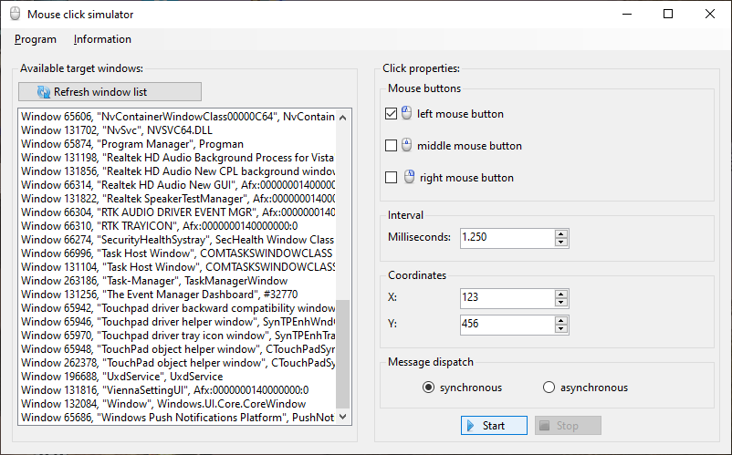

# Mouse Click Simulator

Mouse Click Simulator is a Windows Forms application that can be used to
simulate mouse clicks on any desktop window easily.

## Prerequisites

To run the program you need the .NET 6 runtime.
The current .NET 6 runtime can be downloaded from
<https://dotnet.microsoft.com/en-us/download/dotnet/6.0/runtime>.

## Version history

A changelog is available in [changelog.md](./changelog.md).

## Copyright and Licensing

Copyright 2022  Dirk Stolle

This program is free software: you can redistribute it and/or modify
it under the terms of the GNU General Public License as published by
the Free Software Foundation, either version 3 of the License, or
(at your option) any later version.

This program is distributed in the hope that it will be useful,
but WITHOUT ANY WARRANTY; without even the implied warranty of
MERCHANTABILITY or FITNESS FOR A PARTICULAR PURPOSE.  See the
GNU General Public License for more details.

You should have received a copy of the GNU General Public License
along with this program.  If not, see <http://www.gnu.org/licenses/>.
